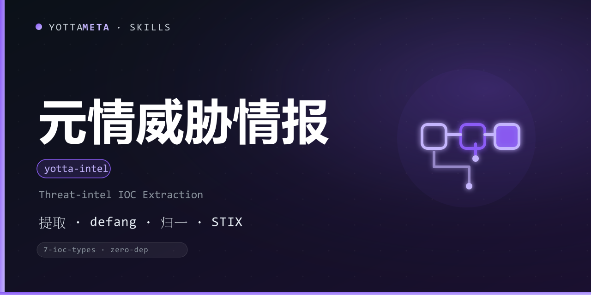

<p align="center"><b>Language</b>: English · <a href="./README.zh-CN.md">中文</a></p>

<p align="center">
  
</p>

<h1 align="center">yotta-intel · 元情 (Yuanqing)</h1>

<p align="center">YottaMeta's zero-dependency threat-intel IOC extraction & normalization engine: extracts <b>IP (IPv4/IPv6), domains, URLs, emails, hashes (MD5/SHA1/SHA256/SHA512) and CVE IDs</b> from threat reports, security write-ups, phishing emails and logs; recognizes and reverses defanged forms; deduplicates and normalizes; outputs <b>CSV / JSON / STIX-lite</b>.</p>
<p align="center">Activates when the user provides text with suspicious IPs / domains / URLs / hashes and needs IOC extraction, normalization, dedup, format conversion, or safe sharing — <b>fully local and offline: no reputation lookups, no sample downloads, no proactive scanning</b>.</p>
<p align="center">No external tools required (Python 3.8+ standard library); Windows + Linux + macOS; every result ships a defanged form for safe sharing plus a Chinese plain-language context line.</p>

<p align="center">
  <a href="LICENSE"></a>
  <a href="https://agentskills.io/"></a>
  <a href="https://www.npmjs.com/package/@yottameta/yotta-intel"></a>
  <a href="https://github.com/YottaMeta/yotta-intel"></a>
  <a href="https://github.com/YottaMeta/yotta-intel/commits/main"></a>
  <a href="https://github.com/YottaMeta/yotta-intel"></a>
</p>

## What it is

Threat analysis often starts with "find the indicators in this blob of text": which suspicious IPs does this report mention? What are the domains / links in that phishing email? What hashes appear and which algorithm do they use? Yuanqing packages this into a zero-dependency engine — no MISP / OpenCTI / commercial intelligence platform needed. It extracts IOCs, handles defang/refang, deduplicates, normalizes, and converts formats using only the Python standard library.

It is not tied to any single platform: it is an agent-agnostic toolkit that works in any agent supporting Agent Skills. **Fully local and offline** — no reputation lookups, no sample downloads, no proactive scanning, no resident service.

## Core value

- **Zero-dependency engine** — seven IOC types + defang/refang + normalization, built entirely with Python 3.8+ standard library.
- **Seven IOC types** — IPv4 / IPv6 / domain / URL / email / hash (MD5/SHA1/SHA256/SHA512) / CVE.
- **defang / refang** — recognizes common defanged forms (`hxxp`, `[.]`, `(.)`, `[dot]`, `[:]`, `[@]`, `[/]`) and reverses them; each result ships a canonical defanged form so sharing does not trigger accidental clicks.
- **Dedup + normalization** — one record per unique IOC with occurrence count, first-seen line and context; domains lowercased + IDN punycode, URLs stripped of default ports, hashes lowercased, IPv6 compressed.
- **Four output modes** — text / JSON / CSV / STIX-lite (STIX 2.1 Bundle + indicator patterns).
- **False-positive control** — TLD whitelist + filename filter (`README.md` / `test.py` are not domains) + CJK-punctuation trimming + hash length checks.

## Why use it

| Advantage | Description |
|---|---|
| **Zero dependency** | Python 3.8+ standard library; no daemon / database / external scanner; Windows + Linux + macOS |
| **Fully local offline** | Processes existing text only; no reputation lookups, no sample downloads, no proactive scanning |
| **defang friendly** | Recognizes mainstream defanged forms and reverses them; outputs a unified defanged form for safe sharing |
| **Explainable** | Each result includes type, count, first-seen line and context; reports candidate indicators only, never verdicts |
| **Low noise** | Deterministic rules: TLD whitelist, filename filter, CJK-punctuation trimming |
| **Ecosystem distribution** | GitHub + npm + ClawHub synced; four install methods (npx / git clone / Download ZIP / install.sh) |

## Commands

| Command | Description |
|---|---|
| extract | Extract IOCs and output structured results (text / json / csv / stix) |
| extract --path / --stdin | Input from a file / standard input |
| extract --types | Extract only the given types (comma-separated, e.g. ipv4,domain,hash) |
| extract --format | Switch output format (text / json / csv / stix) |
| extract --min-count | Keep only IOCs with occurrence count >= N |
| extract --output | Write results to a file (default: stdout) |
| defang | Replace IOCs in the text with safe defanged forms |
| refang | Reverse defanged text back to its raw form |
| --version | Print the version |

Exit codes: extract **0** = no IOCs; **1** = IOCs found; **4** = usage or read error; defang / refang return **0** on success.

## Quick start

Use `python` on Windows and `python3` on Linux/macOS.

```bash
# Extract IOCs from a text file (all types, text output)
python3 scripts/yotta_intel.py extract --path report.txt

# Read from stdin, output JSON
cat intel.txt | python3 scripts/yotta_intel.py extract --stdin --format json

# Domains and hashes only, occurrence count >= 2
python3 scripts/yotta_intel.py extract --path intel.md --types domain,hash --min-count 2

# CSV for spreadsheets / platform import
python3 scripts/yotta_intel.py extract --path intel.md --format csv --output iocs.csv

# STIX 2.1 Bundle
python3 scripts/yotta_intel.py extract --path intel.md --format stix --output iocs.json

# Turn a report into a safe-to-share defanged copy (prevents accidental clicks)
python3 scripts/yotta_intel.py defang --path report.txt --output safe.txt

# Reverse a defanged intelligence note back to its raw form
python3 scripts/yotta_intel.py refang --path safe.txt
```

Sample text output:

```
元情 yotta-intel v0.1.1 —— IOC 提取结果
共发现 2 个 IOC：

■ IPv4 地址（ipv4）
  203.0.113.5  ×1  行 1
    defang: 203[.]0[.]113[.]5
    上下文: 攻击者从 203.0.113.5 发起请求。
```

## Installation

Pick any of the four methods below; the order is the recommended priority. Skill files always come from **npm** (GitHub can be slow without a proxy; npm supports mirrors).

### Method 1: npm one-liner (recommended)

```text
# Optional China mirror: npm config set registry https://registry.npmmirror.com
npx -y @yottameta/yotta-intel --agent <agent-name>      # install to the agent's default user-level skills dir
npx -y @yottameta/yotta-intel --dir <your-skills-dir>   # point to the skills dir itself (e.g. ~/.codex/skills)
```

- `--agent <name>` installs to that agent's default user-level directory; `--list` shows each agent's default directory.
- `--dir <path>` installs to the given directory; for agents not in the preset list, point `--dir` at their skills directory.
- If the mirror has not synced the new package (404): add `--registry=https://registry.npmjs.org/` (a proxy may be needed in China), or wait for the mirror cache.

### Method 2: git clone (developers / git available)

```text
git clone https://github.com/YottaMeta/yotta-intel.git <your-skills-dir>/yotta-intel
```

### Method 3: GitHub Download ZIP (manual / no git)

On the GitHub repository `YottaMeta/yotta-intel`, click **Code → Download ZIP**, unzip it and put the `yotta-intel` folder into the agent's skills directory.

### Method 4: install.sh (multi-agent one-liner script)

```text
bash install.sh --agent <name>   # install to the agent's default user-level directory
bash install.sh --dir <path>     # install to the given directory
bash install.sh --list           # list agents -> default directories
```

> Method 1 uses the npm registry (npmmirror / npmjs) and does not depend on GitHub; Methods 2/3 use GitHub and may fail without a proxy in China.
## Output formats

- **text** — a readable report grouped by type (defanged form + first-seen context included);
- **json** — `{tool, version, generated, source, summary, indicators[]}`; each `indicator` carries `type / value / defanged / count / first_line / snippet`;
- **csv** — `type,value,defanged,count,first_line,snippet`;
- **stix** — a STIX 2.1 Bundle; each IOC becomes an `indicator` (pattern + `x_yottameta_*` extension properties); see `references/stix-lite-spec.md`.

## Development & validation

The package ships its own test script (included in the published package):

```bash
# Run the full suite (103 cases) from the skill directory
python scripts/test_yotta_intel.py
```

Spec details live in `references/`: ioc-spec.md (type rules), defang-rules.md (defang rules), stix-lite-spec.md (STIX mapping).

## License

MIT © YottaMeta — see [LICENSE](./LICENSE).
